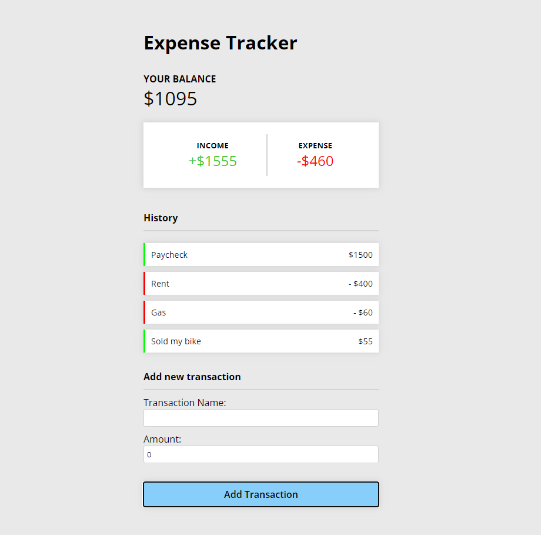

# Expense Tracker
A web application developed in React that allows the user to track their spending by entering their expenses and income. The application will then show a timeline of the spending, breakdown of the spending and the total balance that the user have. 

## Technology Used
- React
- Redux & React Redux
- Redux Persist
- CSS

